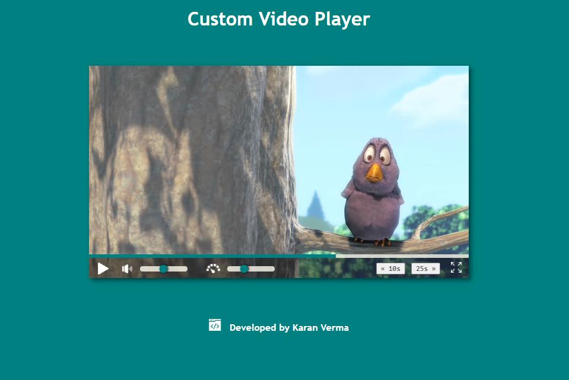

# Custom Video Player

## About the Project


                                Remember the default video player that is there in html, boring!
                                <br>That is why, I have built this. It not only looks good but also have added features
                                like self hiding controls and skip buttons.

## Getting Started

To get a local copy of the project up and running, follow these simple steps:

1. Clone the repository
```sh
git clone https://github.com/karanverma7/custom-video-player.git
```

2. Install Visual Studio Code
3. Install Live Server Extension within VS code.
4. Open the html file with live server.
5. Add video source and play, it's that simple!
    

## License

Distributed under the MIT License. See `LICENSE` for more information.

## Contact
Karan Verma (karanverma1601@gmail.com)
